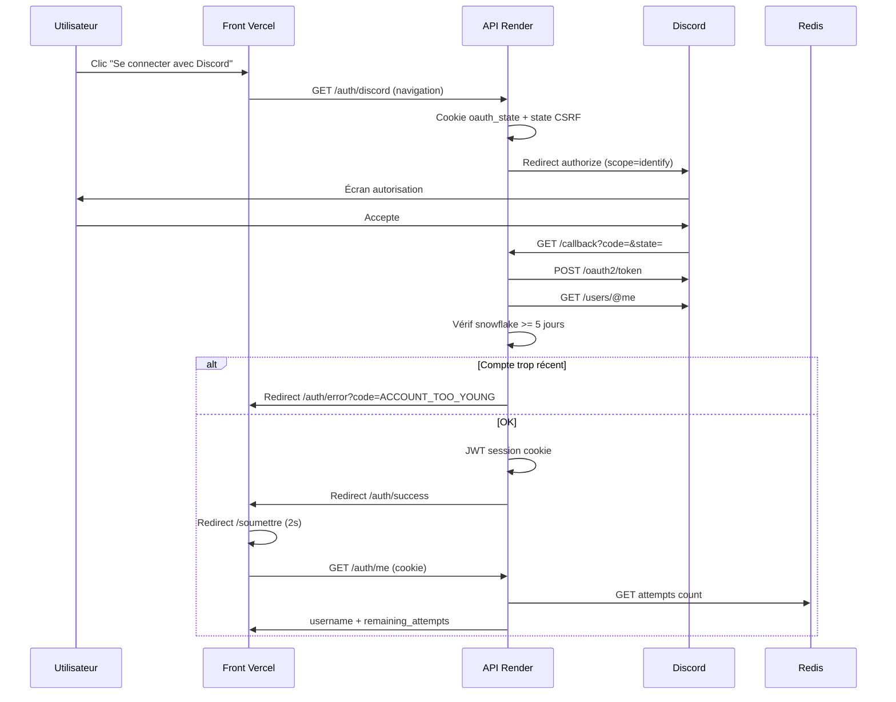

# Leveling: Unite – The Fragments

Documentation technique et fonctionnelle complète du projet.

**Site production :** https://leveling-unite.vercel.app  
**API production :** https://leveling-validate-api.onrender.com  
**Soumission phrase :** https://leveling-unite.vercel.app/soumettre

---

## Table des matières

1. [Vue d'ensemble](#1-vue-densemble)
2. [Concept de l'événement](#2-concept-de-lévénement)
3. [Architecture système](#3-architecture-système)
4. [Frontend — leveling-unite](#4-frontend--leveling-unite)
5. [Backend — leveling-validate-api](#5-backend--leveling-validate-api)
6. [Flux OAuth Discord](#6-flux-oauth-discord)
7. [Flux de soumission de phrase](#7-flux-de-soumission-de-phrase)
8. [Contrat API (référence)](#8-contrat-api-référence)
9. [Configuration et déploiement](#9-configuration-et-déploiement)
10. [Développement local](#10-développement-local)
11. [Données et contenu (mock.ts)](#11-données-et-contenu-mockts)
12. [Règlement événement](#12-règlement-événement)
13. [Sécurité](#13-sécurité)
14. [Maintenance pendant l'événement](#14-maintenance-pendant-lévénement)
15. [Dépannage](#15-dépannage)
16. [Historique et périmètre](#16-historique-et-périmètre)

---

## 1. Vue d'ensemble

**Leveling: Unite – The Fragments** est un événement communautaire d'enquête organisé pour la communauté Discord **Leveling**. Le site web officiel sert de tableau de bord : règles, indices, progression TikTok, déroulé des phases, récompenses, et **soumission finale de la phrase secrète** via authentification Discord.

Le projet est composé de **deux dépôts / dossiers distincts** :

| Projet | Rôle | Stack | Hébergement |
|--------|------|-------|-------------|
| `leveling-unite` | Site vitrine + soumission | SvelteKit 5, Tailwind v4, TypeScript | Vercel |
| `leveling-validate-api` | Auth Discord + validation phrase | Go 1.22, Gin, Redis, JWT | Render (Docker) |

Les deux communiquent exclusivement via HTTP(S). Le front n'a pas de backend intégré : toute la logique sensible (phrase secrète, rate limit, OAuth) est côté API.

---

## 2. Concept de l'événement

### Objectif

Reconstituer une **phrase secrète de 15 mots** fragmentée et distribuée progressivement. Le **premier camp** à soumettre la phrase correcte via le site gagne.

### Durée et dates

- **Titre :** LEVELING: UNITE — The Fragments
- **Durée :** 3 semaines
- **Fin :** 29 juin 2026, 23:59 (heure de Paris, UTC+2)
- **Tagline :** *Aucun joueur ne peut gagner seul. Toute la communauté doit collaborer.*

### Camps

| Camp | Description |
|------|-------------|
| **Les Membres** | Communauté active du serveur Discord Leveling |
| **Le Staff** | Équipe modération / administration (objectif collectif, pas domination) |

### Rôles

| Rôle | Description |
|------|-------------|
| **Fragmentés** | Participants sélectionnés aléatoirement ; reçoivent mots/fragments **confidentiels** en MP Discord |
| **Enquêteurs** | Tous les autres membres ; élaboration de théories, salons dédiés, objectif TikTok |

### Phases (4 × 25 %)

| # | Nom | Contenu |
|---|-----|---------|
| 1 | L'Éveil | Premiers fragments, premières hypothèses |
| 2 | L'Accélération | Nouveaux fragments, fausses pistes *(phase active par défaut)* |
| 3 | Le Chaos | Solution cohérente émerge, salons actifs |
| 4 | La Résolution | Derniers fragments, compte à rebours, course à la soumission |

La phase active est contrôlée par `CURRENT_PHASE_INDEX` (0-based) dans `mock.ts`. Valeur actuelle : **1** (Phase 2).

### Objectif TikTok (données mock)

- **Progression :** 125 000 / 500 000 vues
- **Hashtags :** `#Levelingfitnessapp`, `#LevelingUnite`
- **Paliers :** 10k, 50k, 100k, 250k, 500k (lettres, indices, retrait fausses pistes, indice décisif)

---

## 3. Architecture système

```
┌──────────────────────────────────────────────────────────────────────────┐
│                         UTILISATEUR (navigateur)                          │
└─────────────────────────────────┬────────────────────────────────────────┘
                                  │
          ┌───────────────────────┴───────────────────────┐
          │                                               │
          ▼                                               ▼
┌─────────────────────────┐                 ┌─────────────────────────────┐
│  FRONT (Vercel)         │                 │  DISCORD                    │
│  leveling-unite         │                 │  OAuth2 + serveur communauté│
│  .vercel.app            │                 └──────────────┬──────────────┘
│                         │                                │
│  • SPA statique         │         OAuth redirect         │
│  • mock.ts (contenu)    │◄───────────────────────────────┘
│  • /soumettre           │
└───────────┬─────────────┘
            │ fetch(credentials: include)
            │ PUBLIC_API_URL
            ▼
┌─────────────────────────┐
│  API (Render)           │
│  leveling-validate-api  │
│  .onrender.com          │
│                         │
│  • Gin HTTP server      │
│  • Discord OAuth2       │
│  • JWT cookie session   │
│  • POST /validate       │
└───────────┬─────────────┘
            │
            ▼
┌─────────────────────────┐
│  Redis (Render)         │
│                         │
│  attempts:{user_id}     │  → rate limit 2/24h
│  winner:{user_id}       │  → victoire permanente
└─────────────────────────┘
```

### Principes d'architecture

- **Séparation des responsabilités :** contenu public (front) vs secrets et auth (API).
- **Front 100 % statique :** prerender de toutes les routes, pas de SSR, pas de serveur Node en prod.
- **API stateless :** état utilisateur dans Redis + JWT ; scalable horizontalement avec Redis partagé.
- **Cross-origin cookies :** front (Vercel) et API (Render) sur domaines différents ; cookies `SameSite=None; Secure` en production.

---

## 4. Frontend — leveling-unite

### Stack

| Technologie | Version / détail |
|-------------|-------------------|
| SvelteKit | 2.x |
| Svelte | 5.x (runes : `$state`, `$props`, `$derived`) |
| TypeScript | 6.x |
| Tailwind CSS | 4.x (`@tailwindcss/vite`) |
| Vite | 8.x |
| Adapter | `@sveltejs/adapter-static` |

### Configuration clé

**`src/routes/+layout.ts`**
```ts
export const prerender = true;
export const ssr = false;
```

**`vite.config.ts`** — prerender toutes les routes (`entries: ['*']`), fallback SPA `index.html`.

**`vercel.json`**
```json
{
  "buildCommand": "npm run build",
  "outputDirectory": "build",
  "framework": null,
  "cleanUrls": true
}
```

### Arborescence source

```
leveling-unite/
├── src/
│   ├── app.css                    # Tailwind + imports
│   ├── app.html
│   ├── routes/
│   │   ├── +layout.svelte         # Shell global, favicons, fonts
│   │   ├── +layout.ts             # prerender + ssr false
│   │   ├── +page.svelte           # Accueil
│   │   ├── regles/+page.svelte
│   │   ├── indices/+page.svelte
│   │   ├── objectif-tiktok/+page.svelte
│   │   ├── deroule/+page.svelte
│   │   ├── recompenses/+page.svelte
│   │   ├── concept/+page.svelte
│   │   ├── soumettre/+page.svelte # Soumission phrase + OAuth
│   │   └── auth/
│   │       ├── success/+page.svelte
│   │       └── error/+page.svelte
│   └── lib/
│       ├── api/validate.ts        # Client HTTP vers l'API
│       ├── types/validate.ts      # Types TypeScript API
│       ├── data/mock.ts           # Toutes les données événement
│       ├── components/            # Composants UI
│       ├── styles/modern.css      # Direction artistique
│       ├── actions/reveal.ts      # Animation scroll reveal
│       └── utils/                 # format.ts, countdown.ts
├── static/                        # Favicons, robots.txt
├── .env.example
├── PROJECT.md                     # Ce document
└── vercel.json
```

### Pages et contenu

| Route | Composant shell | Contenu principal |
|-------|-----------------|-------------------|
| `/` | — | Hero, InvestigationDashboard, Timeline, HowToParticipate, NavGrid, SiteFooter |
| `/regles` | PageShell | Accordéon : entraide, confidentialité, critères, inactivité, triche, sanctions |
| `/indices` | PageShell | CluesGrid — fragments débloqués / verrouillés |
| `/objectif-tiktok` | PageShell | Tracker — jauge vues + paliers |
| `/deroule` | PageShell | 4 phases, phase active mise en avant |
| `/recompenses` | PageShell | 3 scénarios de fin |
| `/concept` | PageShell | Rôles, camps, phrase secrète |
| `/soumettre` | PageShell | Auth Discord + formulaire phrase |
| `/auth/success` | — | Confirmation connexion → redirect `/soumettre` |
| `/auth/error` | — | Erreurs OAuth avec codes query |

### Composants UI

| Composant | Fichier | Rôle |
|-----------|---------|------|
| SiteHeader | `SiteHeader.svelte` | Logo, nav (`HEADER_NAV`), badge phase, menu mobile |
| SiteFooter | `SiteFooter.svelte` | Pied de page événement |
| AmbientBackground | `AmbientBackground.svelte` | Orbs, mesh, dégradés animés |
| Hero | `Hero.svelte` | Portail d'accueil : badge, titre, sous-titre, countdown, CTA Discord, liens secondaires |
| InvestigationDashboard | `InvestigationDashboard.svelte` | 4 cartes stats : phase, fragments, TikTok, annonces |
| Timeline | `Timeline.svelte` | Journal transmissions staff (tags URGENT / INDICE / RÈGLE) |
| HowToParticipate | `HowToParticipate.svelte` | 3 étapes participation |
| NavGrid | `NavGrid.svelte` | Grille liens vers sections (Indices featured) |
| PageShell | `PageShell.svelte` | En-tête sous-page, retour accueil, reveal animations |
| CollapseSection | `CollapseSection.svelte` | Accordéon (règles) |
| CluesGrid | `CluesGrid.svelte` | Vault fragments |
| Tracker | `Tracker.svelte` | Jauge TikTok |
| NavIcon | `NavIcon.svelte` | Icônes SVG navigation |
| SectionIntro | `SectionIntro.svelte` | Eyebrow + titre section |

### Direction artistique

- **Fichier principal :** `src/lib/styles/modern.css` (~850 lignes)
- **Palette :** fond `#080a10`, accents bleu néon (`leveling-blue`), violet ambient
- **Typographies :** Orbitron (display), Bebas Neue (hero), Plus Jakarta Sans (body)
- **Patterns UI :** `surface-card`, `hud-panel`, `btn-pill`, `btn-pill--primary`, `glow-border`, `clip-corners`, `section-eyebrow`
- **Animations :** transitions page (`page-enter`), reveal au scroll (`reveal.ts`), orbs flottants

### Client API front

**Fichier :** `src/lib/api/validate.ts`

```ts
import { PUBLIC_API_URL } from '$env/static/public';
```

> **Important :** utiliser `$env/static/public`, pas `import.meta.env`. La variable doit être présente **au moment du build** (Vercel Environment Variables).

| Fonction | Description |
|----------|-------------|
| `isApiConfigured()` | `true` si `PUBLIC_API_URL` non vide |
| `getDiscordLoginUrl()` | URL redirect OAuth (`{API}/auth/discord`) |
| `fetchApiHealth()` | GET `/health` — détecte cold start Render (`ok` / `slow` / `error`) |
| `fetchAuthMe()` | GET `/auth/me` — session courante |
| `submitPhrase(phrase)` | POST `/validate` |
| `logout()` | POST `/auth/logout` |

Tous les appels utilisent `credentials: 'include'` pour envoyer le cookie session cross-origin.

Constante `API_COLD_START_MESSAGE` : message affiché sur le Hero et `/soumettre` quand l'API répond lentement ou est injoignable au démarrage (plan Render Free).

### Hero portal

Le Hero (`Hero.svelte` + `modern.css`) est la zone d'accueil au-dessus du fold. Il ne duplique plus les stats phase / fragments / TikTok — celles-ci sont exclusivement dans `InvestigationDashboard` sur `/`.

**Structure (de haut en bas) :**

1. Badge portail — « Système — le portail est ouvert » (`.hero__portal-badge`, `.clip-corner-sm`)
2. Titre `EVENT.title` + sous-titre `EVENT.subtitle` (`The Fragments`, `.hero__subtitle-portal`, `text-accent-cyan`)
3. Tagline `EVENT.tagline`
4. Countdown fin d'événement (grille portal `.hero__countdown--portal`)
5. CTA Discord dominant — icône SVG inline, `.glow-cta` (pulse + inset glow), lien OAuth via `getDiscordLoginUrl()`
6. Hint tentatives + message cold start API si `fetchApiHealth()` ≠ `ok`
7. Liens secondaires : Règles, Indices, Déroulé, Récompenses, TikTok, Concept

**Classes CSS clés :**

| Classe | Rôle |
|--------|------|
| `.ambient-bg` | Fond portal sur la section hero |
| `.clip-corner-sm` / `.clip-corner-lg` | Coins biseautés HUD |
| `.glow-cta` | Box-shadow inset + outer glow animé sur le CTA Discord |
| `.glow-border` | Bordure lumineuse (cartes, panels) |
| `.hero__portal-dot` | Point vert pulsant du badge |

**Tokens Tailwind** (`app.css` `@theme`) : `accent-cyan` (`#46c8ff`), `bg-system` (`#05060a`).

### Page `/soumettre` — états UI

| État | Condition | Affichage |
|------|-----------|-----------|
| `loading` | Mount initial | « Chargement de votre session… » |
| `unavailable` | API down ou URL non configurée | Message service indisponible + Réessayer |
| `guest` | Non authentifié (401) | Critères + bouton Discord + lien règles |
| `ready` | Authentifié, essais > 0 | Pseudo, compteur essais, textarea, compteur mots |
| `success` | Code `VALID` | Félicitations, formulaire bloqué |
| `already_won` | `already_won` ou code `ALREADY_WON` | Message déjà validé |
| `rate_limited` | `remaining_attempts === 0` | Limite 24h atteinte |

**UX :**
- Compteur mots en temps réel (`X / 15`)
- Confirmation si nombre de mots ≠ 15 avant envoi
- Après `INVALID` : textarea conservé pour correction
- Messages d'erreur via `aria-live`

### Variables d'environnement front

| Variable | Local | Production (Vercel) |
|----------|-------|---------------------|
| `PUBLIC_API_URL` | `http://localhost:8080` | `https://leveling-validate-api.onrender.com` |

Fichier exemple : `.env.example`

---

## 5. Backend — leveling-validate-api

### Stack

| Technologie | Rôle |
|-------------|------|
| Go 1.22 | Langage |
| Gin | Framework HTTP |
| go-redis | Client Redis |
| golang-jwt/jwt v5 | Tokens session HS256 |
| Discord OAuth2 | Authentification (scope `identify`) |

### Arborescence

```
leveling-validate-api/
├── cmd/server/main.go
├── internal/
│   ├── config/config.go
│   ├── discord/
│   │   ├── oauth.go           # Authorization Code Flow
│   │   └── snowflake.go       # Âge compte depuis user ID
│   ├── handlers/
│   │   ├── auth_handler.go
│   │   ├── validate_handler.go
│   │   └── health_handler.go
│   ├── middleware/
│   │   ├── auth.go            # JWT, CORS, cookies
│   │   └── ratelimit.go
│   ├── redis/client.go
│   └── validate/
│       ├── normalize.go
│       └── compare.go         # SHA-256 + constant-time
├── Dockerfile                 # Multi-stage, Alpine runtime
├── docker-compose.yml         # API + Redis local
├── .env.example
└── README.md
```

### Endpoints

#### GET `/health`

Réponse :
```json
{ "status": "ok", "redis": "connected" }
```

Utilisé par Render comme health check.

#### GET `/auth/discord`

- Génère un `state` CSRF (cookie `oauth_state`, 10 min)
- Redirect 302 vers Discord OAuth (`scope=identify`)

#### GET `/auth/discord/callback`

- Valide `state`, échange `code` contre token Discord
- Récupère profil `@me`
- Vérifie âge compte ≥ `MIN_ACCOUNT_AGE_DAYS` (snowflake)
- Émet JWT → cookie `session` httpOnly
- Redirect vers `{FRONTEND_URL}/auth/success`
- Erreurs → redirect `{FRONTEND_URL}/auth/error?code=...`

Codes erreur redirect : `OAUTH_DENIED`, `INVALID_STATE`, `OAUTH_FAILED`, `ACCOUNT_TOO_YOUNG`

#### GET `/auth/me` *(JWT requis)*

```json
{
  "authenticated": true,
  "user_id": "123456789012345678",
  "username": "PseudoDiscord",
  "remaining_attempts": 2,
  "already_won": false
}
```

#### POST `/auth/logout` *(JWT requis)*

Supprime le cookie session.

#### POST `/validate` *(JWT requis)*

Body :
```json
{ "phrase": "mot1 mot2 mot3 ..." }
```

Logique :
1. Vérifier JWT
2. Vérifier `winner:{user_id}` → 409 `ALREADY_WON`
3. Vérifier rate limit → 429 `RATE_LIMITED`
4. **Incrémenter** compteur Redis (chaque essai compte)
5. Normaliser + comparer phrase (constant-time)
6. Si match → `MarkWinner` + 200 `VALID`
7. Sinon → 200 `INVALID` (message générique, aucun indice)

### Normalisation de phrase

Appliquée identiquement à la soumission et à `SECRET_PHRASE` :

1. `TrimSpace`
2. `ToLower` (unicode)
3. `Fields` → espaces multiples collapsés
4. Ponctuation finale par mot retirée : `. ! ? , ; :`

### Rate limiting Redis

| Clé | Type | TTL | Description |
|-----|------|-----|-------------|
| `attempts:{discord_user_id}` | INCR | 24 h depuis 1er essai | Compteur soumissions |
| `winner:{discord_user_id}` | SET "1" | Permanent | Bloque re-soumission après victoire |

Fenêtre : **fixe depuis le premier essai** (pas glissante par requête individuelle).

### Règles métier API

| Règle | Variable | Valeur |
|-------|----------|--------|
| Essais max / fenêtre | `MAX_ATTEMPTS_PER_DAY` | 2 |
| Fenêtre (heures) | `RATE_LIMIT_WINDOW_HOURS` | 24 |
| Âge min compte Discord | `MIN_ACCOUNT_AGE_DAYS` | 5 |
| Durée session JWT | code | 24 h |
| Taille max body `/validate` | code | 2 KB |
| Longueur max phrase | code | 1000 caractères |

**Seule règle d'ancienneté automatique :** 5 jours sur le compte Discord (via snowflake). Pas de vérification d'ancienneté sur le serveur guild.

### Tests

```bash
docker run --rm -v "$(pwd):/app" -w /app golang:1.22-alpine sh -c "go test ./..."
```

Packages testés : `internal/validate`, `internal/discord`, `internal/redis`

---

## 6. Flux OAuth Discord



### Configuration Discord Developer Portal

**OAuth2 → Redirects** (doit correspondre **exactement** à `DISCORD_REDIRECT_URI`) :

| Environnement | URI |
|---------------|-----|
| Local | `http://localhost:8080/auth/discord/callback` |
| Production | `https://leveling-validate-api.onrender.com/auth/discord/callback` |

**Scope :** `identify` uniquement.

> Le callback OAuth passe par **l'API**, pas le front Vercel. Ne pas enregistrer `https://leveling-unite.vercel.app/auth/discord/callback` sur Discord.

---

## 7. Flux de soumission de phrase

```
1. Utilisateur authentifié sur /soumettre
2. Saisit la phrase (15 mots attendus)
3. Front : POST /validate { phrase } + cookie session
4. API : rate limit check → INCR attempts → normalize → compare
5. Réponse JSON avec code + remaining_attempts
6. Front met à jour UI selon code :
   - VALID     → écran succès, already_won = true
   - INVALID   → message rouge, essais décrémentés
   - RATE_LIMITED → écran limite
   - UNAUTHORIZED → retour guest (session expirée)
```

La phrase correcte **n'apparaît jamais** dans les logs, réponses d'erreur ou le code source front.

---

## 8. Contrat API (référence)

### Types front (`src/lib/types/validate.ts`)

```ts
type ApiErrorCode =
  | 'UNAUTHORIZED'
  | 'ACCOUNT_TOO_YOUNG'
  | 'RATE_LIMITED'
  | 'ALREADY_WON'
  | 'INVALID'
  | 'VALID'
  | 'BAD_REQUEST';

interface ValidateResponse {
  success: boolean;
  message: string;
  remaining_attempts?: number;
  code: ApiErrorCode;
}

interface AuthMeResponse {
  authenticated: boolean;
  user_id: string;
  username: string;
  remaining_attempts: number;
  already_won?: boolean;
}
```

### Table codes HTTP / UI

| Code | HTTP | Action UI |
|------|------|-----------|
| `VALID` | 200 | Succès — félicitations |
| `INVALID` | 200 | Phrase incorrecte (message générique) |
| `UNAUTHORIZED` | 401 | Reconnecter Discord |
| `ACCOUNT_TOO_YOUNG` | redirect OAuth | Page `/auth/error` |
| `ALREADY_WON` | 409 | Déjà gagné |
| `RATE_LIMITED` | 429 | Limite 2/jour |
| `BAD_REQUEST` | 400 | Phrase vide ou trop longue |

---

## 9. Configuration et déploiement

### Front — Vercel

1. Repo GitHub connecté à Vercel
2. Build : `npm run build`, output `build/`
3. Variable **obligatoire** :

```env
PUBLIC_API_URL=https://leveling-validate-api.onrender.com
```

4. Redéployer après toute modification de cette variable

**Deploy manuel :**
```bash
cd leveling-unite
npx vercel deploy --prod
```

### API — Render

**Services :**
1. **Redis** — plan Free ou Starter, région Frankfurt recommandée
2. **Web Service** — Runtime Docker, Dockerfile `./Dockerfile`, Health Check `/health`

**Variables d'environnement Render :**

```env
ENV=production
REDIS_URL=<Internal Redis URL depuis dashboard Render>
DISCORD_CLIENT_ID=<Discord App Client ID>
DISCORD_CLIENT_SECRET=<Discord App Client Secret>
DISCORD_REDIRECT_URI=https://leveling-validate-api.onrender.com/auth/discord/callback
FRONTEND_URL=https://leveling-unite.vercel.app
JWT_SECRET=<chaîne aléatoire >= 32 caractères>
SECRET_PHRASE=<15 mots exacts — SECRET, jamais dans Git>
ALLOWED_ORIGINS=http://localhost:5173,https://leveling-unite.vercel.app
COOKIE_DOMAIN=leveling-validate-api.onrender.com
MAX_ATTEMPTS_PER_DAY=2
MIN_ACCOUNT_AGE_DAYS=5
RATE_LIMIT_WINDOW_HOURS=24
```

> Ne pas définir `PORT` — Render l'injecte automatiquement.

**Cookies production :** `ENV=production` active `SameSite=None; Secure` sur le cookie session (requis pour Vercel ↔ Render).

### Checklist mise en prod

- [ ] `/health` retourne `redis: connected`
- [ ] Discord Redirect URI = callback API exact
- [ ] `COOKIE_DOMAIN` = hostname API sans `https://`
- [ ] `PUBLIC_API_URL` sur Vercel + redeploy
- [ ] Test OAuth complet sur `/soumettre`
- [ ] Test soumission phrase fausse + correcte

---

## 10. Développement local

### Prérequis

- Node.js 18+
- Docker Desktop (pour API + Redis)
- Compte Discord Developer (app OAuth)

### Front

```bash
cd leveling-unite
cp .env.example .env
# PUBLIC_API_URL=http://localhost:8080
npm install
npm run dev
# → http://localhost:5173
```

### API

```bash
cd leveling-validate-api
cp .env.example .env
# Remplir DISCORD_*, JWT_SECRET, SECRET_PHRASE
docker-compose up --build
# → http://localhost:8080
```

### Vérifications

```bash
# Front
npm run check
npm run build

# API health
curl http://localhost:8080/health

# Tests Go
docker run --rm -v "%cd%:/app" -w /app golang:1.22-alpine sh -c "go test ./..."
```

### Tests manuels soumission

1. Sans `PUBLIC_API_URL` → « Service indisponible »
2. Discord local → callback → `/auth/success` → `/soumettre`
3. Phrase fausse → `INVALID`, essais décrémentés
4. 3ᵉ essai → `RATE_LIMITED`
5. Phrase correcte (`SECRET_PHRASE` du `.env` API) → `VALID`
6. Déconnexion → état guest

---

## 11. Données et contenu (mock.ts)

**Fichier unique :** `src/lib/data/mock.ts`

Tout le contenu affiché sur le site (hors soumission API) est éditable ici.

### Constantes principales

| Export | Description |
|--------|-------------|
| `EVENT` | Titre, dates, tagline, label Discord |
| `CURRENT_PHASE_INDEX` | Phase active (0-based) |
| `HEADER_NAV` | Liens header (inclut Soumettre) |
| `NAV_LINKS` | Grille navigation accueil |
| `PARTICIPATION_STEPS` | 3 étapes « Comment participer » |
| `SUBMIT_CRITERIA` | Critères affichés sur `/soumettre` |
| `EXPECTED_PHRASE_WORDS` | 15 |
| `MAX_SUBMIT_ATTEMPTS` | 2 |
| `ANNOUNCEMENTS` | Timeline staff |
| `CLUES` | 6 fragments (unlocked: boolean) |
| `TIKTOK_TRACKER` | Vues, goal, hashtags, milestones |
| `PHASES` | 4 phases |
| `REWARDS` | 3 scénarios récompenses |
| `COLLABORATION_RULES` | Entraide |
| `CONFIDENTIALITY_RULES` | Confidentialité fragments |
| `PARTICIPATION_CRITERIA` | Éligibilité Fragmentés |
| `INACTIVITY_RULES` | 24 h sans réponse |
| `CHEATING_CASES` | 5 cas de triche |
| `SANCTIONS` | Membre vs Staff |
| `ROLES`, `CAMPS` | Concept |
| `FINAL_REVEAL` | Après résolution énigme |

### Mettre à jour le site

1. Éditer `mock.ts`
2. `npm run build` (vérifier)
3. Commit + push → Vercel redeploy automatique ou `vercel deploy --prod`

---

## 12. Règlement événement

### Esprit

Enquête **collective** : personne ne possède assez d'informations seul. Entraide encouragée ; confidentialité des fragments MP protégée.

### Confidentialité

- Pas de copier-coller, citation mot pour mot, capture d'écran de fragments MP
- Aide indirecte autorisée (confirmer/infirmer piste sans révéler le mot)

### Éligibilité Fragmentés (site)

- Compte Discord ≥ 5 jours *(vérifié automatiquement à la soumission)*
- Pas de multi-comptes
- Sélection aléatoire
- Engagement actif, réponse sous **24 h**
- Remplaçants secrets désignés

### Inactivité Fragmentés

- 24 h sans réponse aux sollicitations → fragment redistribué

### Triche (5 cas)

1. Fuite de fragments (public, DM, réseaux, captures)
2. Multi-comptes / usurpation
3. Collusion inter-camps (Membres ↔ Staff)
4. Bots, scripts, fuites externes
5. Obstruction volontaire (fausses infos, sabotage)

### Sanctions

**Membre :** exclusion, remplaçant, retrait Hunter Pass du lot, annulation indices si fuite majeure.

**Staff :** exclusion, remplaçant, −100 € enveloppe communautaire.

### Récompenses (victoire Membres)

- 5 Nitro (engagement) + 5 Nitro (giveaway)
- 5 Hunter Pass (engagement) + 5 Hunter Pass (giveaway)
- **10 récompenses au total**

### Révélation finale

Salon secret, message créateur Leveling, modalités récompenses, rôle Discord exclusif.

---

## 13. Sécurité

### API

| Mesure | Détail |
|--------|--------|
| Phrase secrète | Uniquement via `SECRET_PHRASE` env, jamais loggée |
| Comparaison | SHA-256 + `subtle.ConstantTimeCompare` |
| Session | JWT HS256, cookie httpOnly, 24 h |
| Prod cookies | SameSite=None, Secure, domaine API |
| CORS | Liste blanche `ALLOWED_ORIGINS`, credentials true |
| CSRF OAuth | Cookie `oauth_state` + param `state` |
| Body limit | 2 KB sur `/validate` |
| Redis timeout | 2 s |
| Headers | X-Content-Type-Options, X-Frame-Options, Referrer-Policy |

### Secrets — ne jamais commiter

- `DISCORD_CLIENT_SECRET`
- `JWT_SECRET`
- `SECRET_PHRASE`
- `.env` (gitignored)

### Rotation

Si un secret est exposé (chat, commit accidentel) : régénérer immédiatement sur Discord / Render et redeployer.

---

## 14. Maintenance pendant l'événement

| Tâche | Action |
|-------|--------|
| Nouvelle annonce staff | Ajouter entrée dans `ANNOUNCEMENTS` |
| Débloquer fragment | `CLUES[n].unlocked = true` |
| Changer phase | `CURRENT_PHASE_INDEX = n` |
| Mettre à jour vues TikTok | `TIKTOK_TRACKER.currentViews` |
| Changer phrase secrète | `SECRET_PHRASE` sur Render + redeploy API |
| Cold start API Render | Plan Starter ou ping périodique `/health` |

---

## 15. Dépannage

| Symptôme | Cause probable | Solution |
|----------|----------------|----------|
| « Service indisponible » sur `/soumettre` | `PUBLIC_API_URL` absent au build | Vercel env + redeploy |
| 404 `/soumettre` | Ancien deploy | Push + redeploy front |
| `redirect_uri OAuth2 non valide` | URI Discord ≠ `DISCORD_REDIRECT_URI` | Ajouter `/auth/discord/callback` complet |
| Connecté mais `/auth/me` échoue | `COOKIE_DOMAIN` ou CORS incorrect | Vérifier domaine API + `ALLOWED_ORIGINS` |
| `/health` redis disconnected | `REDIS_URL` incorrect | Internal URL Render complète |
| Timeout API (30–60 s) | Cold start Render Free | Attendre ou upgrade plan |
| Session expirée | JWT 24 h | Reconnecter Discord |
| Phrase correcte refusée | Normalisation (casse, ponctuation) | Vérifier `SECRET_PHRASE` normalisée |

### URLs de diagnostic

```bash
curl https://leveling-validate-api.onrender.com/health
```

Navigateur : https://leveling-unite.vercel.app/soumettre

---

## 16. Historique et périmètre

### Livré

- Site responsive, favicons multi-tailles
- Refonte DA moderne (ambient, hero, dashboard, header/footer)
- Pages contenu complètes (règles accordéon, récompenses, concept…)
- API Go production (OAuth, validation, rate limit, tests)
- Page `/soumettre` + auth success/error
- Deploy Vercel + Render
- Fix env SvelteKit (`$env/static/public`)
- Cookies cross-domain prod
- Redirects OAuth vers pages d'erreur front

### Hors périmètre (volontaire)

- CMS / panel admin contenu
- Sync TikTok live
- Vérification jours sur serveur Discord (API)
- Base de données relationnelle
- Monorepo (2 projets séparés conservés)

### Limitations Render Free

- Cold start après inactivité (~30–60 s)
- Redis Free : quota mémoire, expiration possible long terme

---

## Annexes

### Scripts npm (front)

| Commande | Description |
|----------|-------------|
| `npm run dev` | Serveur dev Vite |
| `npm run build` | Build production → `build/` |
| `npm run preview` | Preview build local |
| `npm run check` | svelte-check TypeScript |

### Liens utiles

- [Discord Developer Portal](https://discord.com/developers/applications)
- [Render Dashboard](https://dashboard.render.com)
- [Vercel Dashboard](https://vercel.com/dashboard)
- Site : https://leveling-unite.vercel.app
- API : https://leveling-validate-api.onrender.com

---

*Documentation générée pour Leveling: Unite – The Fragments. Dernière mise à jour : juin 2026.*
